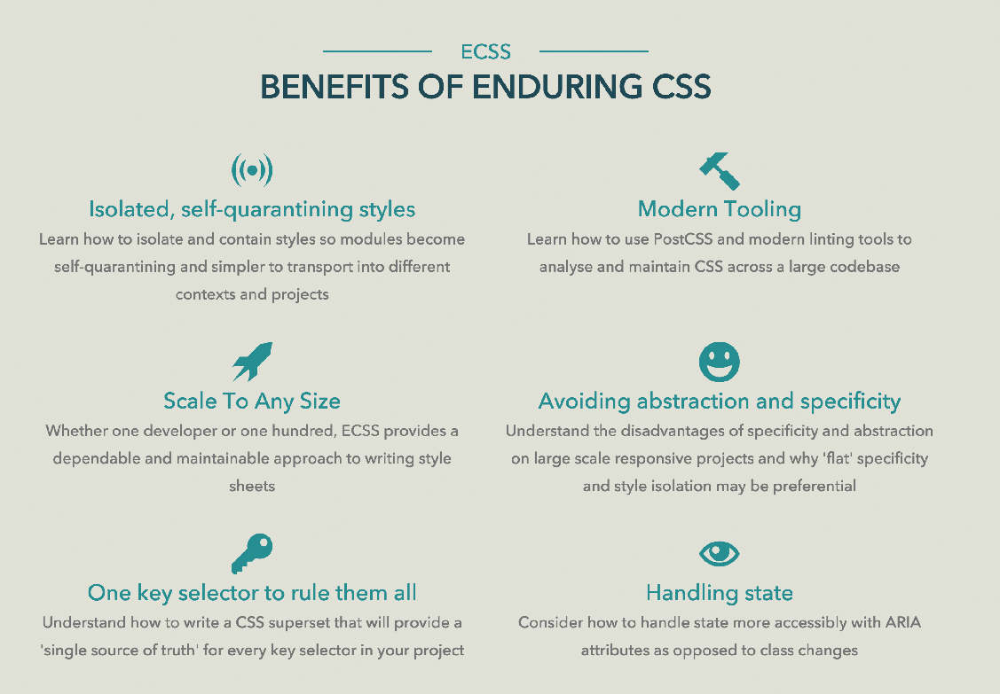
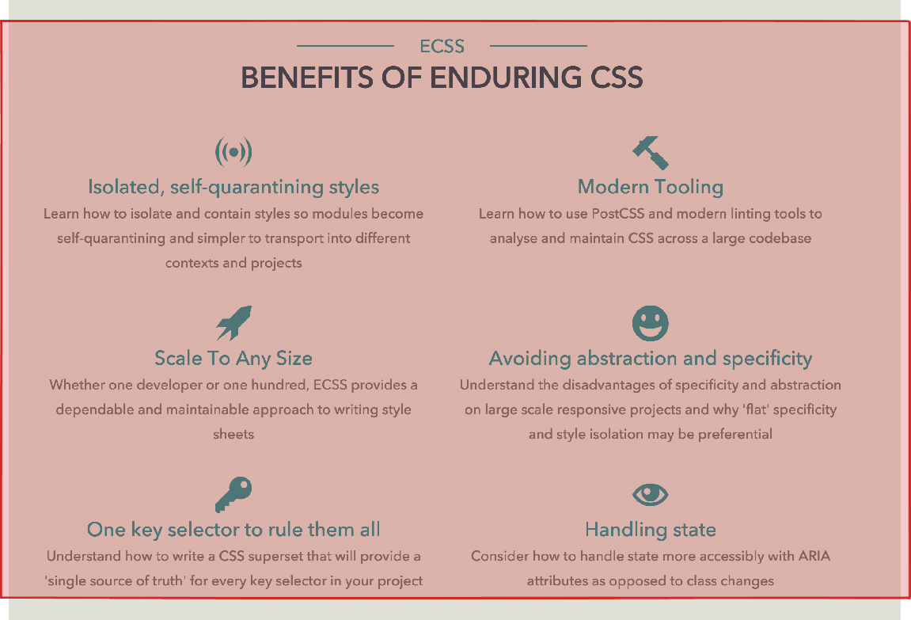
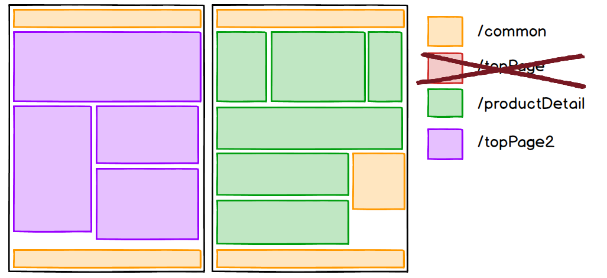

<h1 style="line-height:1.4;font-size:3em;font-family:Helvetica !important; letter-spacing:-.025em">Enduring CSS</h1>

<p style="margin-bottom:0;padding-bottom:0">高津戸壮 <a href="https://twitter.com/Takazudo">@Takazudo</a></p>

----

## 自己紹介

<div style="display:table; width: 100%">
<div style="display:table-cell; vertical-align:middle; width:65%; vertical-align:top; padding:30px 0 0">
<ul>
<li>高津戸壮 (たかつど たけし)</li>
<li><a href="http://www.pxgrid.com/">株式会社ピクセルグリッド</a></li>
<li>フロントエンドエンジニア</li>
<li><a href="twitter.com/Takazudo">@Takazudo</a></li>
</ul>
</div>
<div style="display:table-cell; vertical-align:middle; width:35%"></div>
</div>

---

<a href="https://www.amazon.co.jp/dp/4774169447"></a>

----

## 何それ

* CSS設計思想の一つ
* を著した本
* Ben Frain著
* サイトで全部読める [ecss.io](http://ecss.io/)
* そんな有名でもない

----

## ECSSの特徴

* Enduring: 長続きする、永続的な、不朽の、我慢強い、辛抱強い
* デカくてスケールするサイト向け
* 色々試したけど違うなーって思って考えたらしい


----

## OOCSS


```html
<button class="button button_caution">...</button>
<button class="button button_pdf">...</button>
<button class="button button_play">...</button>
```

----


----

## すべてが解決するか？

* どうモジュールを切ればいいのか
* class名をどうつければいいのか
* 複雑になってしまうのだが？

----

## ECSSはこう考える

* 複雑にしない
* 分けて考える
* 抽象化を避ける

----

<ol style="font-size:1.6em">
<li>モジュール化
<li>名前空間
<li>アセットの分離
<li>クラス名の命名規則
</ol>

----

## 1.モジュール化

* そんな細かくはしない
* ネストしたりもなるべくしない

---



---


---



---


---


---

## 同じようなものも別物<br>なぜか？

* そっちのほうが分かりやすいから
* 複雑化を防ぐことができるから
* 同じようなCSSを何度も<br>書かないといけないのでは？
* それでもいい。gzipとかすればいい

----

## 2.名前空間

* モジュールを名前空間でグルーピングする

---


---


---


---


topPage, productDetail, shoppingCart

---


common

---

## 名前空間の分け方例

好きに考えとくれ〜

* CMSで出しているテンプレートが違う
* ここだけWordPressで出している
* サイト全体で共通
* 管理する部署が違う

----

## 3.アセットの分離

* 名前空間ごとに読み込むCSS、JS、画像類を完全に分離

---

## 例えばこう


---

```bash
.namespaces
  ├── common
  │  ├── common.css
  │  └── common.js
  ├── productDetail
  │  ├── productDetail.css
  │  └── productDetail.js
  └── topPage
      ├── topPage.css
      └── topPage.js
```

---



---

```bash
.namespaces
  ├── common
  │  ├── common.css
  │  └── common.js
  ├── productDetail
  │  ├── productDetail.css
  │  └── productDetail.js
  └── topPage2
      ├── topPage2.css
      └── topPage2.js
```

---


---

## 分離しなかったら？

* 旧topPageリソース消せないですよね？
* このCSS消していいんだろうか…
* この画像どこに置けばいいんだろう…
* このモジュール変更するのが怖い

いや、そもそも変更出来ないし消せない

----

## 4.クラス名の命名規則

* BEM的命名規則に名前空間の考えを足したもの

---


---

## BEMでは……

<table style="font-size:1.2em">
<tr><th>Block   </th><td>`.tab`</td></tr>
<tr><th>Element </th><td>`.tab__item`</td></tr>
<tr><th>Modifier</th><td>`.tab__item--active`</td></tr>
</table>

---

```html
<div class="tab">
  <button class="tab__item">One</button>
  <button class="tab__item tab__item--active">Two</button>
  <button class="tab__item">Three</button>
  <button class="tab__item">Four</button>
</div>
```

---

## ECSSでは……

<p style="font-size:1.4em">`.ns-Module_ChildNode-variant`</p>

<div style="height:11px"></div>

<table style="font-size:1.2em">
<tr><th>Module     </th><td>`.tp-Tab`</td></tr>
<tr><th>Child node </th><td>`.tp-Tab_Item`</td></tr>
<tr><th>Variant    </th><td>`[aria-current="true"]`</td></tr>
</table>

variantにはwai-ariaとかも使うと良いぞと

---

```html
<div class="tp-Tab">
  <button class="tp-Tab_Item">One</button>
  <button class="tp-Tab_Item" aria-current="true">Two</button>
  <button class="tp-Tab_Item">Three</button>
  <button class="tp-Tab_Item">Four</button>
</div>
```

----

## ECSSが私に<br>もたらしたもの

モジュール名決定の難しさからの開放


`media`? `imageBlock`? `productItem`?

---

### 汎用的な名前 `media` にしたとする

* モディファイアを多用して複雑化
* どこで使われているか分からない
* 結果CSSを変更できない
* 当然このモジュールのCSSは消せない
* 似たのが出たら`media2`？
* その使い分けを把握するのは困難
* 何回も使いまわせるのでCSS容量的には<br>ハッピーではある

---

### 名前空間の嬉しさ


`tp-Media`

---

### `tp-Media`

* トップページだけで使う想定で作っている
* どこで使われるのか明確
* どこかで使われるかもと考える必要がほぼ無い
* いらなくなったらトップページだけ見て消せる
* `tp-FeaturedProduct`とか具体的にしてよい
* 名前空間というスコープ内で考えることができる
* 同じようなモジュールが出ても別モジュール<br>として考えることになるのでCSS容量的には増大

----

## まとめ

* ECSSは「分けて」考える
* だからいくらでもスケールできる
* 管理と名前付けにシンプルさをもたらす
* 無理のない管理を実現する
* ミニマムなCSSを目指すものではない
* 最高のパフォーマンスは求めていない

----

# ありがとう<br>ございました

----

<a href="http://www.codegrid.net/"></a>

----

* [ECSS](http://ecss.io/)
* [Enduring CSSの設計思想](https://app.codegrid.net/series/2016-ecss)
* [知っておきたいHTMLテンプレート設計法](https://app.codegrid.net/series/2014-html-template)

